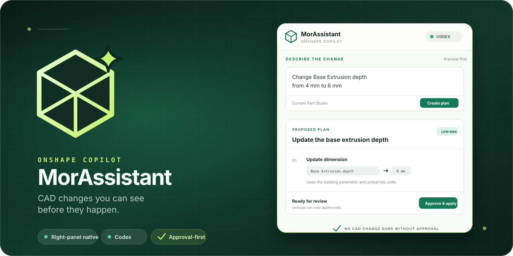
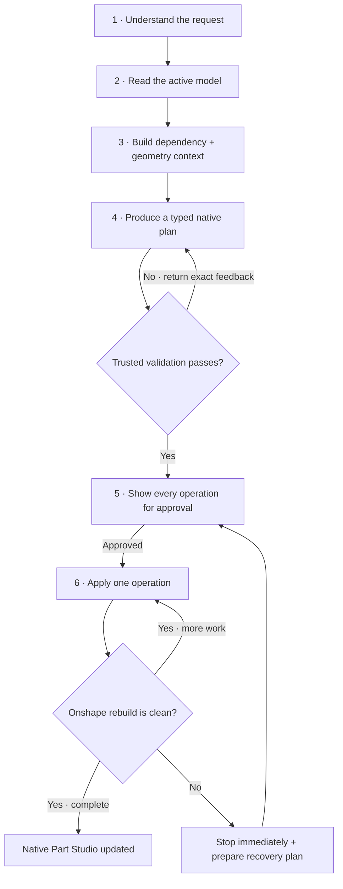
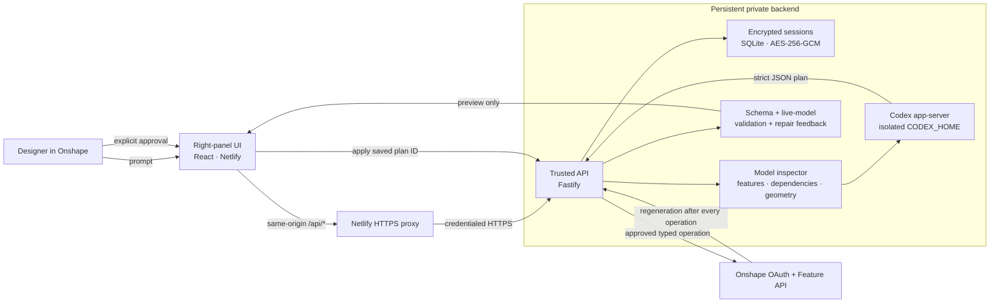

<p align="center">
  
</p>

<p align="center">
  <a href="https://app.netlify.com/projects/morassistant-onshape/deploys"></a>
  <a href="LICENSE"></a>
  
  
  
</p>

<p align="center">
  <strong>Describe a CAD edit. Inspect the exact operations. Approve only when they look right.</strong>
</p>

<p align="center">
  <a href="https://morassistant-onshape.netlify.app">Panel</a>
  ·
  <a href="docs/onshape-installation.md">Install in Onshape</a>
  ·
  <a href="docs/personal-tailscale-deployment.md">Personal deployment</a>
  ·
  <a href="docs/app-store-release-checklist.md">App Store release</a>
  ·
  <a href="SECURITY.md">Security</a>
</p>

---

## AI CAD, without the leap of faith

MorAssistant is a free, open-source **Onshape right-panel copilot** powered by Codex. It lives beside the feature tree—like other native Onshape integrations—so the workflow stays inside the Part Studio:

1. describe the change in plain language;
2. receive a small, structured plan tied to the current feature IDs and values;
3. review every proposed operation;
4. select **Approve & apply**;
5. keep Onshape Undo available as the familiar escape hatch.

> [!IMPORTANT]
> MorAssistant is an installable Onshape application, **not a standalone CAD website**. The Netlify page is the iframe UI used by Onshape; the persistent API is the trusted boundary that owns OAuth, validates plans, and applies approved operations.

### Why it is different

| Native workflow | Approval is a boundary | Stale-plan protection | Isolated credentials |
|:--|:--|:--|:--|
| Opens from the Part Studio element sidebar. | Planning cannot mutate CAD. Apply is a separate request. | A preview is rejected if its feature name, parameter expression, payload hash, or microversion is no longer current. | Onshape tokens stay in encrypted storage; each Codex user gets a separate `CODEX_HOME`. |

## From a sentence to a native parametric model

MorAssistant does not draw pixels and it does not upload a mesh. It reads and edits Onshape's actual feature database.



The model context is deliberately CAD-shaped:

| Context | What the agent receives | Why it matters |
|:--|:--|:--|
| Feature definitions | IDs, names, types, editable expressions, bounded native BTM payloads, exact hashes | Enables precise edits without guessing existing identifiers |
| Dependency graph | Direct `dependsOn` and `usedBy` edges for every feature | Exposes downstream blast radius before replace/delete operations |
| Design intent signals | Repeated literal expressions and existing `#variable` references | Supports variable extraction and parametric cleanup |
| Geometry | Solid/body, face, edge, and vertex counts plus bounded body details | Gives the planner topology evidence instead of only feature names |
| Physical properties | Part count, volume, mass, and centroid when Onshape can calculate them | Helps check scale and geometric plausibility |
| Rebuild state | Per-feature Onshape status before and after each edit | Separates pre-existing problems from failures introduced by the plan |

Read-only geometric analysis uses Onshape's FeatureScript evaluation API. Persistent changes use Onshape's native Feature API, so the result remains editable, ordered, parametric CAD. Invalid model output is not merely rejected: the validation failure is fed back into the same planning thread for up to three bounded repair passes.

## Use it inside Onshape

For a private installation:

1. Open the MorAssistant listing in the Onshape App Store and select **Subscribe**.
2. Refresh Onshape and open a **workspace Part Studio**.
3. Select the MorAssistant cube icon in the element right sidebar.
4. If requested, grant **Onshape access** under **My account → Applications**.
5. Select **Continue with ChatGPT** once to connect Codex—no OpenAI API key is requested.
6. Enter a prompt, review the plan, then approve it.

Example prompts:

```text
Create five sketches, all different-size squares on the Top plane
Create a 25 mm × 40 mm rectangle sketch named Mounting Profile
Extrude Mounting Profile 15 mm as a new body
Add a 3 mm fillet to the outer edges of Base Extrusion
Rename Sketch 1 to Base Profile
Rename Extrude 1 to Base Extrusion
Change Base Extrusion depth from 4 mm to 6 mm
```

The complete Developer Portal configuration and private-install test are in [docs/onshape-installation.md](docs/onshape-installation.md).

## What works today

| Capability | Status | Guardrail |
|:--|:--:|:--|
| Read the active Part Studio model | ✅ | Feature payload, dependency, topology, mass-property, and rebuild inspection |
| Evaluate FeatureScript for geometry analysis | ✅ | Read-only lambda evaluation; no persistent mutation |
| Self-correct an invalid generated plan | ✅ | Up to three schema + live feature-tree validation passes |
| Create rectangle and square sketches on Top | ✅ | Typed millimeter geometry, unique names, captured v15 payload fixture |
| Create any standard native Part Studio feature | ✅ Beta | Bounded BTM payload, ordered feature-name references, Onshape v15 validation |
| Replace a complete existing feature | ✅ Beta | Exact SHA-256 snapshot match plus microversion guard |
| Delete an existing feature | ✅ | Exact ID/name match, high-risk preview, explicit approval |
| Rename existing features | ✅ | Exact feature ID and current-name match |
| Update existing quantity expressions | ✅ | Exact parameter ID and current-expression match |
| Verify every operation against regeneration | ✅ | Stop immediately on the first newly introduced Onshape error |
| Prepare a recovery plan after failure | ✅ | Re-reads partially changed state; recovery requires a fresh approval |
| Reject replay and double approval | ✅ | Durable plan status plus concurrency guards |
| Survive backend restarts | ✅ | Encrypted SQLite sessions and persistent Codex credentials |
| Edit versions | Refused | Versions are immutable; only `w` contexts are accepted |
| Edit dimensions in custom configurations | Refused | Renames remain available; ambiguous configured edits fail closed |
| Assemblies, drawings, releases, and document administration | Roadmap | The current extension is intentionally scoped to the active Part Studio |

Common operations use dedicated typed builders. Everything else in the active Part Studio can use the bounded native-feature fallback: Codex proposes the exact payload, the panel labels it as a native operation, the API validates its structure and references, and Onshape performs final feature validation after approval. Assemblies, drawings, release workflows, and persistent custom FeatureScript definitions need their own element-specific APIs and are not silently treated as Part Studio operations.

For the detailed data flow, trust boundaries, state machine, and failure behavior, read **[Architecture: how MorAssistant reasons and recovers →](docs/architecture.md)**.

## The trust boundary



The model never receives an Onshape OAuth token, never sends arbitrary REST requests, and never performs CAD mutations during planning. The API accepts only the typed operation set defined in `@morassistant/cad-command-schema`.

### Safety properties

- **Preview before mutation** — creating a plan and applying it are separate endpoints.
- **Timeout-resistant planning** — the panel starts a background planning job and polls it, so a long Codex turn never depends on a CDN request timeout.
- **Strict structured output** — Codex output is normalized and parsed through a closed schema.
- **Bounded self-repair** — invalid generated plans receive precise validator feedback for at most three attempts.
- **Dependency-aware impact** — direct downstream dependents are surfaced before whole-feature replacement or deletion.
- **Current-state validation** — feature names, parameter expressions, and Onshape concurrency metadata must still match.
- **Per-operation verification** — execution stops on the first operation that introduces a new regeneration error.
- **Approval-gated recovery** — a failed run can generate an alternate plan from the refreshed model, but cannot apply it automatically.
- **Rate-aware inspection** — unchanged-microversion geometry evidence is cached, duplicate feature-tree reads are avoided during apply, and short Onshape `Retry-After` windows are honored automatically.
- **Replay resistance** — pending plans transition atomically and cannot be applied twice.
- **Origin checks** — state-changing browser requests must come from the configured panel origin.
- **Minimum secrets exposure** — Codex child processes inherit a deliberately small environment with no backend OAuth secrets.
- **Encrypted persistence** — OAuth tokens and plans are authenticated-encrypted before SQLite writes.

## Repository map

```text
MorAssistant/
├── apps/onshape-panel/          # narrow React right-panel interface
├── services/api/                # OAuth, sessions, planning, approval, execution
├── services/codex-worker/       # isolated Codex app-server lifecycle
├── services/onshape-mcp/        # internal development MCP adapter
├── packages/cad-command-schema/ # trusted operation and plan contracts
├── packages/onshape-client/     # typed Onshape feature API client
├── packages/shared-types/       # shared context and connection types
├── scripts/                     # mock pipeline + personal deployment tooling
├── docs/                        # install, hosting, and release playbooks
└── assets/                      # application and repository artwork
```

## Local development

### Requirements

- Node.js 22 or newer
- npm
- a current `codex` CLI with `codex app-server`

```bash
git clone https://github.com/MayoWolf/MorAssistant.git
cd MorAssistant
cp .env.example .env
npm install
```

Export the development environment and start both services:

```bash
set -a
source .env
set +a
npm run dev
```

| Service | Default URL |
|:--|:--|
| Onshape panel | `http://127.0.0.1:5173` |
| API | `http://127.0.0.1:3000` |

Example local panel context:

```text
http://127.0.0.1:5173/?documentId=DOCUMENT_ID&workspaceOrVersion=w&workspaceId=WORKSPACE_ID&elementId=ELEMENT_ID
```

## Test the whole pipeline

```bash
npm run check
npm audit --omit=dev
```

`npm run check` runs every workspace typecheck, every production build, the unit suite, and a deterministic end-to-end integration pipeline. That pipeline covers:

- Onshape OAuth state and token exchange;
- Codex device-code completion and event-race handling;
- the current Codex app-server sandbox and structured-output protocol;
- plan validation against a live feature snapshot;
- dependency, topology, FeatureScript, and mass-property inspection;
- bounded correction of an initially invalid Codex plan;
- approval-gated typed and native feature creation, whole-feature replacement, deletion, rename, and dimension mutations;
- per-operation regeneration inspection, fail-fast execution, and approval-gated recovery planning;
- stale-plan, replay, and concurrent duplicate-apply rejection;
- iframe, CORS, request-origin, workspace, configuration, and Onshape-stack guards.

For a browser-visible test with mock Onshape and Codex services:

```bash
npm run mock:pipeline
```

The mock pipeline is deterministic and never touches a real Onshape document or OpenAI account.

## Deployment

MorAssistant deliberately separates the static panel from the stateful worker:

| Layer | Personal deployment | Public/multi-user deployment |
|:--|:--|:--|
| Panel | Netlify, Git-linked from `main` | Any monitored HTTPS static host |
| API + Codex | Local Docker + Tailscale Funnel | Monitored, horizontally scalable container service |
| Identity | Private installation token bound to one owner | Verified per-user Onshape identity and OAuth handoff |
| Persistence | Local encrypted SQLite + Codex directories | Encrypted durable volume/database with retention controls |

See:

- [Netlify frontend deployment](docs/netlify-deployment.md)
- [Zero-cost personal deployment with Tailscale Funnel](docs/personal-tailscale-deployment.md)
- [Generic persistent backend deployment](docs/backend-deployment.md)

> [!WARNING]
> The private installation-token mode is intentionally single-user. Do not reuse it for a public App Store release. Public distribution requires per-user identity, capacity controls, deletion/retention policy, monitoring, and a continuously available backend.

## Onshape App Store

The app is registered as an **Integrated Cloud App** with an **Element right panel** extension scoped to **Inside part studio**. The release playbook covers the private listing, subscription flow, beta matrix, Onshape QA, and public launch requirements:

**[Read the App Store release and test checklist →](docs/app-store-release-checklist.md)**

Primary references: [Onshape extensions](https://onshape-public.github.io/docs/app-dev/extensions/), [App Store workflow](https://onshape-public.github.io/docs/app-store/), [testing guidelines](https://onshape-public.github.io/docs/app-store/testingguidelines/), and [Codex app-server](https://developers.openai.com/codex/app-server).

## Contributing

Thoughtful contributions are welcome—especially new guarded operations backed by real, versioned Onshape fixtures.

1. Read [CONTRIBUTING.md](CONTRIBUTING.md).
2. Keep planning and execution separated.
3. Add validation and end-to-end coverage for every operation.
4. Run `npm run check` before opening a pull request.

Report suspected vulnerabilities privately through [SECURITY.md](SECURITY.md). Community participation is governed by [CODE_OF_CONDUCT.md](CODE_OF_CONDUCT.md).

## License and trademarks

Copyright © 2026 Wolf Nazari. Licensed under the [Apache License 2.0](LICENSE).

MorAssistant is an independent project and is not affiliated with, endorsed by, or sponsored by Onshape, PTC, OpenAI, or the makers of Adam. Onshape and related marks belong to their respective owners.
