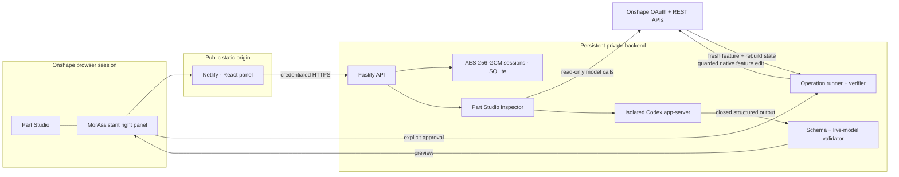
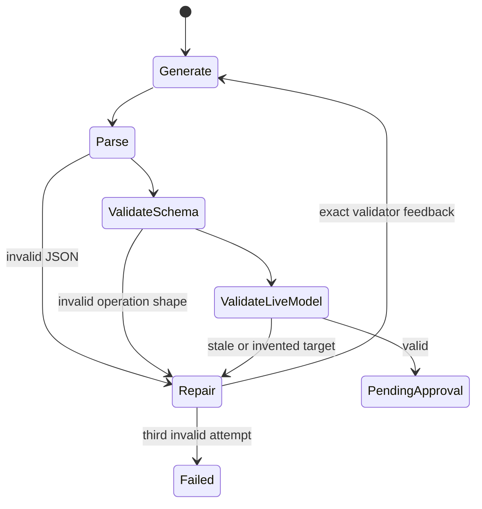
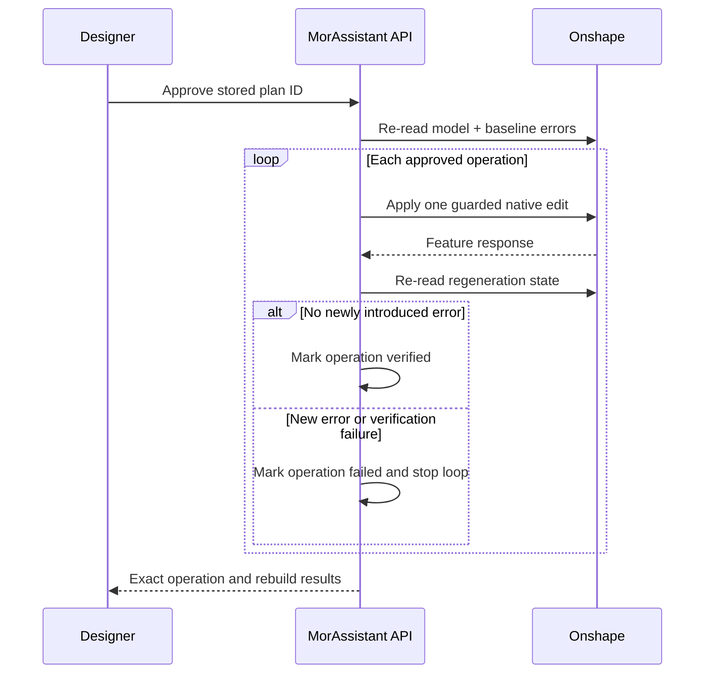

# MorAssistant architecture

> Native Onshape edits, an explicit approval boundary, and a rebuild-aware recovery loop.

MorAssistant is an Onshape element right-panel extension. The panel is a narrow control surface; the product's real work happens in a private trusted backend that reads the current Part Studio, asks Codex for a typed plan, validates it against the live model, and applies only the plan the designer approved.

The central rule is simple:

> The model may propose. The trusted host validates. The designer approves. Onshape decides whether the CAD rebuilds.

## System map



Netlify hosts no OAuth secret and no Codex credential. The browser receives a private installation token only through the Onshape extension launch fragment; the panel moves it into session storage and removes it from the visible URL. The persistent backend holds encrypted Onshape tokens and one isolated `CODEX_HOME` per user.

## 1. Model inspection

Planning begins with a fresh `getPartStudioFeatures` response. MorAssistant retains the exact native feature definitions within strict size budgets and derives a compact model index.

```text
Part Studio inspection
├── feature identity
│   ├── featureId, name, featureType, order
│   ├── editable quantity expressions
│   ├── regeneration status
│   └── SHA-256 snapshot fingerprint
├── dependency graph
│   ├── dependsOn[]
│   └── usedBy[]
├── design-intent hints
│   └── repeated literal expressions
└── geometry evidence
    ├── body details
    ├── mass properties
    └── transient FeatureScript topology probe
```

Dependency edges are extracted only from references to known top-level feature IDs. This is intentionally conservative: an omitted edge makes the planner less confident, while an invented edge can misrepresent design intent. Whole-feature changes also receive an automatically generated downstream-dependency warning when direct consumers are known.

The geometry probe is a FeatureScript lambda evaluated by Onshape against the current context. Evaluation is transient. It counts solid bodies, faces, edges, and vertices; it does not insert a FeatureScript feature or persist an operation.

Body-detail and mass-property calls are best-effort. If Onshape cannot calculate one source—for example, an empty Part Studio or a part with missing material density—feature-level planning remains available and the missing evidence is recorded in the plan trace.

Geometry evidence is cached in memory by user, element, configuration, and exact source microversion for ten minutes. The last verified feature tree and bounded geometry evidence are also persisted inside the session's AES-256-GCM encrypted payload. Repeated prompts against an unchanged model therefore avoid expensive geometry reads, and a backend restart does not discard the verified fallback. The cache is bounded and cannot cross users.

Onshape `429` responses honor `Retry-After` for short windows. During a longer feature-list throttle, planning may use the last verified snapshot and records that fact in the preview. Apply remains guarded by the snapshot's exact source microversion and `rejectMicroversionSkew: true`. When Onshape accepts a mutation, its response supplies the new feature, feature state, serialization version, and source microversion; MorAssistant can safely advance the encrypted snapshot and continue per-operation verification without inventing state.

## 2. Planning and bounded self-repair

Codex runs in a read-only, network-disabled app-server turn. It receives CAD data, not OAuth credentials. Its response must match one closed JSON schema with an approval-required literal.



The same planning thread gets exact trusted-host feedback and the complete model snapshot again. Repair is bounded to three total attempts. A malformed or stale plan never becomes a preview, and a planning loop cannot run indefinitely.

The operation language currently includes:

- guarded rename and quantity-expression edits;
- a typed Top-plane rectangle/square sketch builder;
- bounded creation of native `BTMFeature-134` and `BTMSketch-151` payloads;
- exact-hash replacement of an existing native feature;
- explicit high-risk feature deletion.

Native payloads may refer to existing or earlier-created features with `@feature:Exact Name`. The trusted Onshape client resolves those references immediately before mutation, after re-reading the feature tree.

## 3. Approval and stale-plan protection

A stored plan is immutable user intent tied to a specific model snapshot. Planning and applying are different HTTP requests.

Before the first mutation, MorAssistant re-reads the Part Studio and rejects the plan if any relevant invariant moved:

| Operation | Required current-state match |
|:--|:--|
| Rename | Feature ID and current name |
| Dimension | Feature ID, feature name, parameter ID, and expression |
| Create | Unique feature name and resolvable ordered references |
| Replace | Feature ID, name, and exact SHA-256 feature payload hash |
| Delete | Feature ID and current name |

Onshape mutations also carry the latest serialization version and source microversion with `rejectMicroversionSkew: true`. A second approval, replay, or concurrent duplicate apply is rejected by durable plan state.

## 4. Execute, verify, stop

Approved operations run in order. After every successful API mutation, MorAssistant immediately re-reads Onshape regeneration state before proceeding.



Pre-existing regeneration errors are fingerprinted before execution and reported separately. They do not falsely fail an unrelated clean edit. A changed status or message is treated as new evidence and fails closed.

MorAssistant does not pretend that re-adding a deleted feature is a universal rollback: Onshape can assign new IDs and downstream references can be topology-sensitive. The safe default is to stop, expose the partial result, preserve Onshape Undo, and plan from reality.

## 5. Recovery without silent mutation

When execution fails, the backend can open a new planning job containing:

- the original user request;
- the original plan summary;
- every applied or failed operation result;
- newly introduced regeneration errors;
- a fresh inspection of the partially changed Part Studio.

Codex is told not to repeat successful work. The alternate is stored as a new `pending` plan with `recoveryForPlanId` provenance. It appears in the panel with a clear recovery notice and needs its own **Approve & apply** action.

This produces an agentic recovery loop without erasing the approval boundary.

## Failure matrix

| Failure | Mutation possible? | Behavior |
|:--|:--:|:--|
| Onshape/Codex disconnected | No | Setup state; no plan is created |
| Geometry evidence unavailable | No | Continue with feature evidence and show trace warning |
| Invalid Codex JSON/schema | No | Return validator feedback and retry, maximum three attempts |
| Invented or stale feature reference | No | Reject during live-model validation and retry |
| Model changes after preview | No | Reject apply with conflict; create a fresh plan |
| Onshape rejects an operation | Maybe not | Record exact operation failure and stop |
| Operation introduces rebuild error | Yes | Record failure immediately; do not run later operations |
| Recovery planner fails | No additional | Keep the failed result visible; do not mutate further |
| Duplicate approval/replay | No additional | Reject from durable plan state |

## Scope

MorAssistant's broad native fallback is intentionally scoped to the active **workspace Part Studio**. That surface includes sketches, variables, extrudes, revolves, sweeps, lofts, holes, fillets, chamfers, shells, booleans, patterns, transforms, splits, mate connectors, and other valid native Part Studio feature payloads.

“Anything in Onshape” is not one API context. Assemblies have instances and mates; drawings have views and annotations; release management has workflow state; versions are immutable. Supporting those surfaces safely means adding context-specific inspectors, operation schemas, approval language, concurrency rules, and verification—not sending Part Studio payloads to unrelated endpoints.

## Verification

`npm run check` type-checks and builds every workspace, then runs unit and full-pipeline tests. The deterministic pipeline covers OAuth, Codex sign-in, dependency/geometry inspection, invalid-plan self-repair, approval, native mutation, microversion guards, per-operation rebuild verification, encrypted snapshot persistence, a forced `429` planning-and-apply fallback, fail-fast behavior, and separately approved recovery.

The mock services never contact a real Onshape document or OpenAI account. A production release still requires the live Onshape App Store matrix in [app-store-release-checklist.md](app-store-release-checklist.md).
