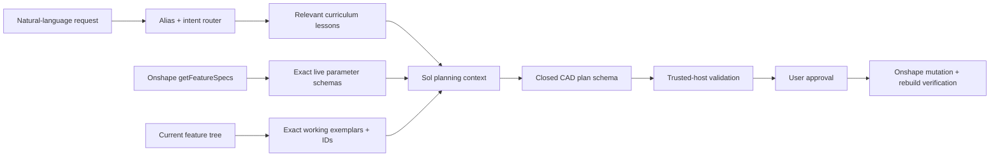

# Onshape capability curriculum

> 177 durable tool lessons, exact live feature schemas, and a testable route from “I know this tool” to “I can safely apply it.”

MorAssistant does not try to memorize one fragile REST payload for every toolbar button. Onshape explicitly exposes the internal feature format through the Feature API, and those parameters can evolve. MorAssistant therefore combines two knowledge layers:

1. a versioned curriculum that teaches **what each tool is for, what geometry it requires, how to choose its modes, and how to verify it**;
2. the active Part Studio's authenticated **live feature specifications**, which provide exact current and custom FeatureScript parameter schemas.

The implementation lives in [`packages/onshape-client/src/capability-catalog.ts`](../packages/onshape-client/src/capability-catalog.ts). The catalog is machine-readable, validated for unique and complete entries, searchable by natural-language aliases, available through MCP, and injected into every Codex planning turn.

## Coverage

| Tool family | Lessons | Examples |
|:--|--:|:--|
| Sketch geometry | 25 | Lines, rectangles, circles, arcs, ellipses, splines, Bézier, conics, text, slots, polygons, image/DXF, wrap |
| Sketch constraints | 16 | Dimensions, coincident, concentric, parallel, perpendicular, tangent, curvature, equal, symmetric, normal, pierce, fix |
| Sketch editing | 14 | Trim, extend, split, fillet, chamfer, offset, project/use, intersection, mirror, patterns, transform |
| Solid features | 26 | Extrude, revolve, sweep, loft, fillet, chamfer, draft, shell, hole, rib, boolean, split, thicken, direct editing |
| Surface features | 9 | Boundary, fill, offset, ruled, constrained, face blend, move boundary, mutual trim, surface workflow |
| Curve features | 12 | Helix, 3D fit spline, projected, bridging, composite, intersection, trim, isocline, offset, routing |
| Patterns and transforms | 6 | Linear, circular, curve, mirror, transform, replicate |
| Construction and parameters | 8 | Planes, mate connectors, variables, query variables, configurations, tables |
| Sheet metal | 12 | Model, flange, hem, tab, bend, form, loft, joints, corners, relief, finish |
| Frames | 5 | Members, trim, gusset, end cap, cut list |
| Assembly mates | 12 | Fastened, revolute, slider, planar, cylindrical, pin-slot, ball, parallel, tangent, width, group |
| Assembly relations | 4 | Gear, rack-and-pinion, screw, linear |
| Assembly management | 12 | Insert, replace, replicate, patterns, mirror, fix, positions, display states, exploded views, BOM, simulation |
| Inspection | 7 | Measure, mass properties, feature/dependency tree, live specs, flat pattern, cut list, regeneration |
| Metadata and configuration | 9 | Rename, dimensions, material, appearance, properties, suppression, deletion, MBD |
| **Total** | **177** | Complete current modeling curriculum |

## How a planning turn learns a tool



For a request such as “sweep a tube along a 3D spline and bevel both ends,” routing selects the Sweep, 3D fit spline, Pierce, and Chamfer lessons. The live catalog contributes the exact `sweep` and `chamfer` specifications available in that Part Studio. Existing features contribute valid native payload examples and stable references. Sol must then produce the closed plan format; it cannot call Onshape directly.

## Execution levels

Knowing a tool and safely executing it are different claims. Every lesson declares an execution level:

| Level | Meaning |
|:--|:--|
| `typed` | A deterministic MorAssistant builder owns the complete payload and unit conversion. This is the preferred route for rectangles, circles, blind solid extrudes/cuts, feature-edge fillets, and equal-offset feature-edge chamfers. |
| `native_sketch` | The tool is represented inside a native `BTMSketch-151`. Use exact live/current geometry and constraint encodings; never invent undocumented BTM types. |
| `native_feature` | The tool is a Part Studio feature. Use the live feature spec plus an exact snapshot exemplar when available, then let Onshape validate and regenerate it. |
| `assembly_api` | The tool belongs to an Assembly and needs assembly-specific occurrence, mate, and solve guards. It is taught now but is not disguised as a Part Studio edit. |
| `read_only` | Inspection or evaluation that cannot persist geometry. |
| `ui_only` | A browser-only workflow with no safe supported mutation route yet. |

This distinction prevents the model from responding to “I recognize Chamfer” by fabricating a payload. If an exact required schema or exemplar is missing, it must use a supported construction, state the uncertainty in the preview, or refuse that operation.

## Sketch curriculum

Sketches are not just collections of coordinates. The curriculum teaches a deliberate order:

1. choose a stable plane or planar face;
2. create the smallest sensible set of curves;
3. add geometric relationships such as coincident, horizontal, tangent, equal, or symmetric;
4. add unit-aware driving dimensions and variables;
5. check solver state and profile closure;
6. verify that regions and references consumed by later features are stable.

The catalog covers every Sketch help topic in Onshape's current sitemap, including construction geometry, automatic inference, imported images/DXF, projection, intersection, spline controls, patterns, and troubleshooting.

## Extrude, revolve, sweep, and loft

The agent is taught to treat these as families of modes rather than single buttons:

- **body type:** solid, surface, or thin;
- **result:** new, add, remove, or intersect where supported;
- **bounds:** blind, symmetric, through-all, up-to-next, up-to-face/part/vertex, starting offset, and second direction;
- **references:** profile regions, axis, connected path, guide curves, lock direction/faces, and ordered sections;
- **shape controls:** draft, twist, scale, thickness, start/end continuity, connections, and merge scope;
- **verification:** target body count, direction, termination, continuity, and regeneration state.

The typed `extrude_sketch` path implements the most reliable common subset, including direction, symmetry, and a blind starting offset. Typed sketches can target Top `(X,Y)`, Front `(X,Z)`, or Right `(Y,Z)`; the plane normal is treated as a deliberate modeling axis. More advanced modes use the exact live `extrude` spec and an existing exemplar rather than extending a guessed payload.

## Spatial intelligence and real-world plausibility

Feature regeneration proves that geometry is mathematically legal, not that the object makes sense. Before emitting a plan, the agent must establish a world coordinate frame and check axes, sides, bilateral pairs, ground contact, clearance, interference, and relative proportions.

For an ordinary vehicle the convention is Z up, X longitudinal, and Y left-to-right. Wheel profiles therefore lie on the Front plane and extrude along Y. Front and rear profiles are placed at different X positions and wheel-radius Z height; separate outward extrudes start beyond the lower-Y and upper-Y chassis sides. A deterministic spatial compiler pairs the two sides at every axle and derives exact world-coordinate start offsets from a matching Top-plane chassis profile. It explicitly accounts for Onshape's Front datum normal pointing toward world −Y: an `opposite` Front offset or extrusion points toward +Y. Offset sign and outward extrusion direction are evaluated separately, which keeps translated vehicles correct instead of accidentally mirroring one side around the global origin. Trusted validation then rejects Top-plane vehicle wheels, center-spanning axle rollers, missing side pairs, and chassis intersections before they reach the approval panel.

## Fillets, chamfers, shells, and direct editing

Selection is often harder than the numeric parameter. MorAssistant resolves current transient topology immediately before typed feature-edge fillets. The curriculum also distinguishes edge, face, and full-round fillets; constant and variable radii; equal-distance, two-distance, and distance-angle chamfers; inward/outward shells with removed faces; and replace/move/delete-face direct edits.

Every mutation is followed by a fresh regeneration check. A plan stops at the first newly introduced failure instead of continuing with invalid topology.

## Sheet metal, frames, and assemblies

These tool families have additional invariants:

- sheet metal must retain a valid flat pattern, bend rules, relief, and manufacturable corners;
- frames must retain correct profile orientation, end treatment, member grouping, and cut-list output;
- assemblies operate on occurrences and mate connectors, solve degrees of freedom, and use a different API surface from Part Studios.

MorAssistant already understands and routes all of these tools. Persistent Assembly mutation remains explicitly separated until its occurrence/mate concurrency and solve verification layer is implemented. That is safer than pretending an Assembly mate is a `BTMFeature-134` Part Studio feature.

## Live and custom features

`GET /partstudios/.../featurespecs` is read once per document/library version and cached for one hour in bounded backend memory. The planner receives:

- an inventory of every available feature type;
- full relevant specs selected for the current request;
- exact native payloads of existing features when within the inspection budget.

This teaches document-specific custom FeatureScript tools and future Onshape releases without giving Codex network or OAuth access. If the endpoint is rate-limited, the static curriculum remains available and the preview records that exact live schemas were unavailable.

## Verification

Automated checks cover:

- catalog completeness, uniqueness, category counts, and natural-language routing;
- exact live feature-spec retrieval and configuration forwarding;
- bounded selection of relevant specs, including custom-feature inventory;
- delivery of both curriculum and live specs to the isolated Codex worker;
- the full OAuth → inspection → plan → approval → native mutation → regeneration pipeline.

Run the full suite with:

```bash
npm run check
npm audit --omit=dev
```

The live App Store release matrix should additionally exercise at least one representative from every execution family in a disposable Onshape document, because topology-dependent CAD cannot be exhaustively proven by a mocked server.
